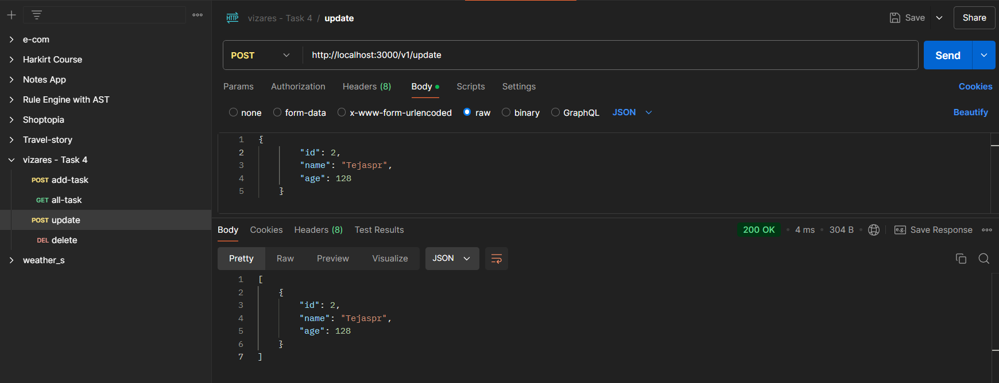

# Task 4: Express.js CRUD API Documentation

### Project Overview

This project is a simple backend API built using Express.js that handles basic CRUD (Create, Read, Update, Delete) operations. The API stores data in an in-memory array, meaning it does not use a database.

### How to Run the Project

1. Clone the repository
   ```bash
   git clone <repository-url>
   ```
2. Navigate to the project directory
   ```bash
   git clone <repository-url>
   ```
3. Navigate to the project directory
   ```bash
   npm install
   ```
4. Install dependencies
   ```bash
   npm start
   ```
   The server will start on http://localhost:3000/v1/ (don't forget /v1/).

### Endpoints
Use Postman or a similar tool to send HTTP requests to the endpoints.Ensure the Content-Type is set to application/json for POST and DELETE requests.

  1.Create a Task

- Endpoint: POST /add-task
- Description: Adds a new task to the in-memory array.
- Request Body (JSON):
  ```bash
  {
    "name": "",
    "age": 30
  }
  ```
- Response: Returns the created task with an auto-generated id.
  ```bash
  {
    "id": 1,
    "name": "John Doe",
    "age": 30
  }
  ```

2. Get All Tasks

- Endpoint: GET /all-task
- Description: Retrieves all tasks stored in the in-memory array.
- Response: Returns an array of tasks.
  ```bash
  [
      {
          "id": 1,
          "name": "John Doe",
          "age": 30
      },
      {
          "id": 2,
          "name": "Jane Smith",
          "age": 25
      }
  ]
  ```

3. Update a Task

- Endpoint: POST /update
- Description: Updates an existing task by id.
- Request Body (JSON):
  ```bash
  {
      "id": 1,
      "name": "John Updated",
      "age": 31
  }
  ```
- Response: Returns the updated task.
  ```bash
  {
      "id": 1,
      "name": "John Updated",
      "age": 31
  }
  ```

4. Delete a Task

- Endpoint: DELETE /delete-task
- Description: Deletes a task by id.
- Request Body (JSON):
  ```bash
  {
      "id": 1
  }
  ```
- Response: Returns the updated array of tasks after deletion.
  ```bash
  Deleted successfully
  ```

#
Thank You! 👋